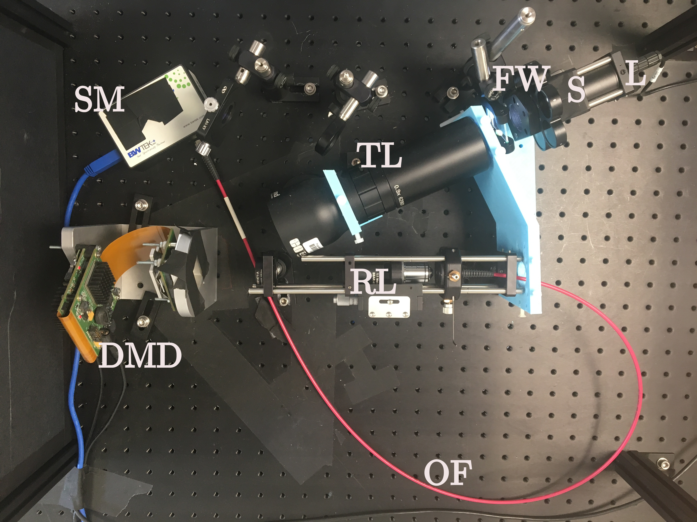

# Single-Pixel Hyperspectral Imaging (SPIHIM) Datasets
We provide several datasets that we acquire with a computational hyperspectral imager.

*License:* The SPIHIM datasets are distributed under the Creative Commons Attribution 4.0 International license ([CC-BY 4.0](https://creativecommons.org/licenses/by/4.0/))

*Reference:* Please reference this work
* A Lorente Mur, B Montcel, F Peyrin, N Ducros. Deep neural networks for single-pixel compressive video reconstruction. SPIE Photonics Europe, Proc. vol. 11351, Unconventional Optical Imaging II,  pp.27, Apr 2020, France. [⟨hal-02547800⟩](https://hal.archives-ouvertes.fr/hal-02547800/)

*Contact:* nicolas.ducros@insa-lyon.fr, CREATIS Laboratory, University of Lyon, France.

# Setup Description
### Hardware
The set-up is depicted below and in detail [[ALM2020](https://hal.archives-ouvertes.fr/hal-02547800/document)]. The telecentric lens (TL; Edmund Optics 62901) is positioned such that its image side projects the image of the sample (S) onto the digital micro-mirror device (DMD; vialux V-7001), which is positioned at the object side of the lens. The object is transparent and is illuminated by a LED lamp (L; Thorlabs LIUCWHA/M00441662). The DMD can implement different light patterns by reflection of the incident light onto a relay lens (RL), which projects the light into an optical fiber (OF; Thorlabs FT1500UMT 0.39NA). This optical fiber is connected to a compact spectrometer (SM; BWTek examplar BRC115P-V-ST1). A filter wheel (FW) containing neutral optical densities is placed behind the lamp to reduce the light flux

### Mathematical Model
The setup acquires M = α HF where F in **R** n x λ represents the sample hypercube, H in **R** m x n the measurement matrix, and α is a multiplicative factor that depends on  and the optical density. The measurement matrix contains the patterns that are uploaded onto the DMD. Here, m represents the number of patterns, n the number of pixels of the patterns, and λ the number of spectral bins.

The multiplicative factor is given by α = φ 10-OD Δt (in photons), where φ (in photons/s) represents the given light flux, OD is neutral optical density and Δt is the integration time.

### Hadamard Acquisitions
We acquire Hadamard patterns that we split into positive and negative parts, which are concatenated in the measurement matrix. Precisely, Hm contains the positive parts and Hm+1 the negative parts, such that Hm - Hm+1 is a Hadamard pattern.

We sequentially upload onto the DMD all of the m = 2 x 4096 Hadamard (split) patterns of dimension n = 64 x 64 pixels. The patterns in PNG format can be downloaded [here](https://www.creatis.insa-lyon.fr/~ducros/Spihim/Hadamard_64x64.zip). 

We acquire different datasets for the same object by selecting different neutral densities OD and different integration times Δt.

# Summary of the SPIHIM datasets
The following datasets are provided
* 04-Feb-2020 session ([description](#04-Feb-2020-session)).
  [Download zip](https://www.creatis.insa-lyon.fr/~ducros/Spihim/spihim_2020-Feb-04.zip).

* 11-Jun-2020 session ([description](#11-Jun-2020-session)).
  [Download zip](https://www.creatis.insa-lyon.fr/~ducros/Spihim/spihim_2020-Jun-11.zip).

* 01-Jul-2020 session ([description](#01-Jul-2020-session)).
  [Download zip](https://www.creatis.insa-lyon.fr/~ducros/Spihim/spihim_2020-Jul-01.zip)

* 18-Nov-2020 session ([description](#18-Nov-2020-session)).
  [Download zip](https://www.creatis.insa-lyon.fr/~ducros/Spihim/spihim_2020-Nov-18.zip)  

* All datasets compatible with SPYRIT deep reconstruction networks (e.g., [Comp-Net](https://github.com/openspyrit/spyritexamples/2020_ISBI_CNet/))

  [Download zip](https://www.creatis.insa-lyon.fr/~ducros/Spihim/spihim_2020_nets.zip)  

We provide the description of each measurement session in the sections below. 

# Data Reading, measurement matrix, and reconstruction

Based on [SPIRiT](https://github.com/nducros/SPIRIT), we provide matlab scripts that

* read, reconstruct and plot the datasets (see `./scripts/read_*_.m`)
* build the forward operator H that maps the image of the sample the onto the measured Hadamard coefficients (see `./scripts/build_forward_operator.m`)

The (full) Hadamard matrix H in **R** n x n can be downloaded [here](https://www.creatis.insa-lyon.fr/~ducros/Spihim/Hadamard_64x64_forward_stl10_unlabeled.mat). It applies to a measurement vector in **R** n, where the missing coefficients have been field with zeros. To compute the (reduced) measurement matrix H in **R** m x n, see `./scripts/build_forward_operator.m`.

The acquisition is such that the patterns with maximum variance are acquired first. We provide [here](https://www.creatis.insa-lyon.fr/~ducros/Spihim/Hadamard_64x64_cov_stl10_unlabeled.mat) the covariance matrix used to defined the acquisition order ; it was computed on the [STL-10](https://ai.stanford.edu/~acoates/stl10/) image dataset.

# Description of the SPIHIM datasets
#### 04-Feb-2020 session  
We acquired four samples:
* A [star sector target](https://www.thorlabs.com/thorproduct.cfm?partnumber=R1L1S2P) printed on a paper sheet in black an white
* A [star sector target](https://www.thorlabs.com/thorproduct.cfm?partnumber=R1L1S2P) printed on a paper sheet printed in color according to a Hue color wheel
* A paper sheet with no printing
* No object, i.e., the illumination LED lamp directly

Filename | M | Δt (ms) | Comment |
|--|--:|--:|--|
SiemensBW1a_raw.mat | 408 | 4 |  black and white star sector |
SiemensColor8a_raw.mat | 408 | 32 | color star sector |
SiemensColor8b_raw.mat | 1228 | 32 | color star sector |
mydata_raw.mat | 512 | 4 |  |
paperSheet1b_raw.mat | 1228 | 4 | paper sheet |
paperSheet2b_raw.mat | 1228 | 8 | paper sheet |
paperSheet4b_raw.mat | 1228 | 16 | paper sheet |
siemensStar1a_raw.mat | 408 | 4 | black and white star sector |
siemensStar1b_raw.mat | 1228 | 4 | black and white star sector |
siemensStar2a_raw.mat | 408 | 8 | black and white star sector |
siemensStar2b_raw.mat | 1228 | 8 | black and white star sector |
siemensStar4a_raw.mat | 408 | 16 | black and white star sector |
siemensStar4b_raw.mat | 1228 | 16 | black and white star sector |
siemensStar8a_raw.mat | 408 | 32 | black and white star sector |
siemensStar8b_raw.mat | 1228 | 32 |black and white star sector  |
siemensStarColor1b_raw.mat | 1228 | 4 | color star sector |
siemensStarColor2b_raw.mat | 1228 | 8 | color star sector |
siemensStarColor4b_raw.mat | 1228 | 16 | color star sector |
siemensStarColor4c_raw.mat | 2456 | 16 | color star sector |
siemensStarColor8d_raw.mat | 4096 | 32 | color star sector |
whiteLED1a_raw.mat | 408 | 4 | no object |

#### 11-Jun-2020 session  
First, we acquired the LED source directly with no sample

Filename | Δt (ms) | OD (-)| Comment |
|--|--:|--:|--|
noObjectD_1_0.0_raw.mat | 4 | 0.0 | Saturate
noObjectD_1_0.3_01_raw.mat | 4 | 0.3 | Repeat same measurement 4x to simulate longer Δt while avoiding saturation
noObjectD_1_0.3_02_raw.mat | 4 | 0.3 |
noObjectD_1_0.3_03_raw.mat | 4 | 0.3 |
noObjectD_1_0.3_04_raw.mat | 4 | 0.3 |
noObjectD_1_0.3_raw.mat | 4 | 0.3 |
noObjectD_1_0.6_raw.mat | 4 | 0.6 |
noObjectD_1_1.0_raw.mat | 4 | 1.0 |
noObjectD_1_1.3_raw.mat | 4 | 1.3 |

Second, we acquired the [star sector target](https://www.thorlabs.com/thorproduct.cfm?partnumber=R1L1S2P)

Filename | Δt (ms) | OD (-)| Comment |
|--|--:|--:|--|
starSectorD_2_0.0_01_raw.mat | 8 | 0.0 | Repeat same measurement 4x to simulate longer Δt while avoiding saturation
starSectorD_2_0.0_02_raw.mat | 8 | 0.0 |
starSectorD_2_0.0_03_raw.mat | 8 | 0.0 |
starSectorD_2_0.0_04_raw.mat | 8 | 0.0 |
starSectorD_2_0.0_05_raw.mat | 8 | 0.0 |
starSectorD_2_0.0_06_raw.mat | 8 | 0.0 |
starSectorD_2_0.0_07_raw.mat | 8 | 0.0 |
starSectorD_2_0.0_08_raw.mat | 8 | 0.0 |
starSectorD_2_0.0_09_raw.mat | 8 | 0.0 |
starSectorD_2_0.0_10_raw.mat | 8 | 0.0 |
starSectorD_2_0.0_raw.mat | 8 | 0.0 |
starSectorD_2_0.3_raw.mat | 8 | 0.3 |
starSectorD_2_0.6_raw.mat | 8 | 0.6 |
starSectorD_2_1.0_raw.mat | 8 | 1.0 |
starSectorD_2_1.3_raw.mat | 8 | 1.3 |

Third, we acquire the [star sector target](https://www.thorlabs.com/thorproduct.cfm?partnumber=R1L1S2P) that was off-centered

Filename | Δt (ms) | OD (-)| Comment |
|--|--:|--:|--|
R1L1S2P_1_0.0_raw.mat | 4 | 0.0 | Shows the 'R1L1S2P' writing
R1L1S2P_1_0.3_raw.mat | 4 | 0.3 |
R1L1S2P_1_0.6_raw.mat | 4 | 0.6 |
R1L1S2P_1_1.0_raw.mat | 4 | 1.0 |
R1L1S2P_1_1.3_raw.mat | 4 | 1.3 |
Thorlabs_1_0.0_raw.mat | 4 | 0.0 | Shows the 'THORLABS' writing
Thorlabs_1_0.3_raw.mat | 4 | 0.3 |
Thorlabs_1_0.6_raw.mat | 4 | 0.6 |

Finally, we acquire images from the STL10 databaset

Filename | Δt (ms) | OD (-)| Comment |
|--|--:|--:|--|
stl10_01_32ms_cp_raw.mat | 32 | 0.0 | horse displayed on my cell phone (cp)
stl10_01_32ms_ps_raw.mat | 32 | 0.0 | horse printed on a paper sheet (ps)
stl10_01_64ms_ps_raw.mat | 64 | 0.0 | horse printed on a paper sheet (ps)
stl10_08_32ms_ps_raw.mat | 32 | 0.0 | bird printed on a paper sheet (ps)

#### 01-Jul-2020 session  
First, we acquired the LED source directly with no sample. Note that the `noObjectF1` series and the `noObjectF2` series refer to two different positions of the LED lamp.

Filename | Δt (ms) | OD (-)| Comment |
|--|--:|--:|--|
noObjectF1_1_0.3_01_raw.mat | 4 | 0.3 | Repeat same measurement 15x to simulate longer Δt while avoiding saturation
noObjectF1_1_0.3_02_raw.mat | 4 | 0.3 |
noObjectF1_1_0.3_03_raw.mat | 4 | 0.3 |
noObjectF1_1_0.3_04_raw.mat | 4 | 0.3 |
noObjectF1_1_0.3_05_raw.mat | 4 | 0.3 |
noObjectF1_1_0.3_06_raw.mat | 4 | 0.3 |
noObjectF1_1_0.3_07_raw.mat | 4 | 0.3 |
noObjectF1_1_0.3_08_raw.mat | 4 | 0.3 |
noObjectF1_1_0.3_09_raw.mat | 4 | 0.3 |
noObjectF1_1_0.3_10_raw.mat | 4 | 0.3 |
noObjectF1_1_0.3_11_raw.mat | 4 | 0.3 |
noObjectF1_1_0.3_12_raw.mat | 4 | 0.3 |
noObjectF1_1_0.3_13_raw.mat | 4 | 0.3 |
noObjectF1_1_0.3_14_raw.mat | 4 | 0.3 |
noObjectF1_1_0.3_15_raw.mat | 4 | 0.3 |
noObjectF1_1_0.3_raw.mat | 4 | 0.3 |
noObjectF1_1_0.6_raw.mat | 4 | 0.6 |
noObjectF2_1_0.3_01_raw.mat | 4 | 0.3 | Not the same LED lamp position as in the `noObjectF1` series. We repeat same measurement 9x to simulate longer Δt while avoiding saturation
noObjectF2_1_0.3_02_raw.mat | 4 | 0.3 |
noObjectF2_1_0.3_03_raw.mat | 4 | 0.3 |
noObjectF2_1_0.3_04_raw.mat | 4 | 0.3 |
noObjectF2_1_0.3_05_raw.mat | 4 | 0.3 |
noObjectF2_1_0.3_06_raw.mat | 4 | 0.3 |
noObjectF2_1_0.3_07_raw.mat | 4 | 0.3 |
noObjectF2_1_0.3_08_raw.mat | 4 | 0.3 |
noObjectF2_1_0.3_09_raw.mat | 4 | 0.3 |
noObjectF2_1_0.3_raw.mat | 4 | 0.3 | Not the same LED lamp position as in the `noObjectF1` series
noObjectF2_1_0.6_raw.mat | 4 | 0.6 |
noObjectF2_1_1.0_raw.mat | 4 | 1.0 |
noObjectF2_1_1.3_raw.mat | 4 | 1.3 |

Filename | Δt (ms) | OD (-)| Comment |
|--|--:|--:|--|
stl10_03_1_0.0_raw.mat | | |
stl10_05_1.5_0.0_01_raw.mat | | |
stl10_05_1.5_0.0_02_raw.mat | | |
stl10_05_1.5_0.0_03_raw.mat | | |
stl10_05_1.5_0.0_04_raw.mat | | |
stl10_05_1.5_0.0_05_raw.mat | | |
stl10_05_1.5_0.0_06_raw.mat | | |
stl10_05_1_0.0_raw.mat | | |
stl10_05_1_0.3_raw.mat | | |
stl10_05_1_0.6_raw.mat | | |

#### 18-Nov-2020 session  
Contrary to previous datasets, the DMD frequency is set to 1 kHz and the DMD patterns are 4-bit (see `par.DMD_fr` and `par.bitplane`).

Filename | M | Δt (ms) | Comment |
|--|--:|--:|--|
noObject_01ms_raw.mat | 8192 | 1 |  |
noObject_10ms_raw.mat | 8192 | 10 |  |
starSector_01ms_raw.mat | 8192 | 1 | Starsector in the image plane |
starSector_variableFilter_C_10ms_raw.mat | 8192 | 10 | Starsector in the image plane, filter between lamp and image plane |
variableFilter_01ms_raw.mat | 8192 | 1 | Filter in the image plane | 
variableFilter_10ms_raw.mat | 8192 | 10 | Filter in the image plane|
variableFilter_B_01ms_raw.mat | 8192 | 1 | Filter in the image plane |
variableFilter_B_10ms_raw.mat | 8192 | 10 | Filter in the image plane |
variableFilter_C_10ms_raw.mat | 8192 | 10 | Filter in the image plane `|`
